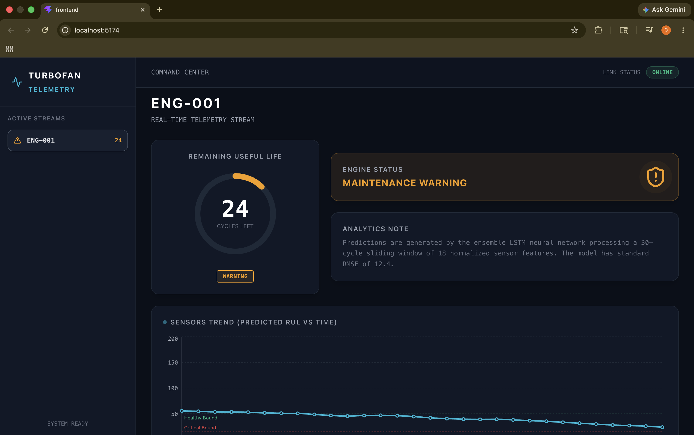
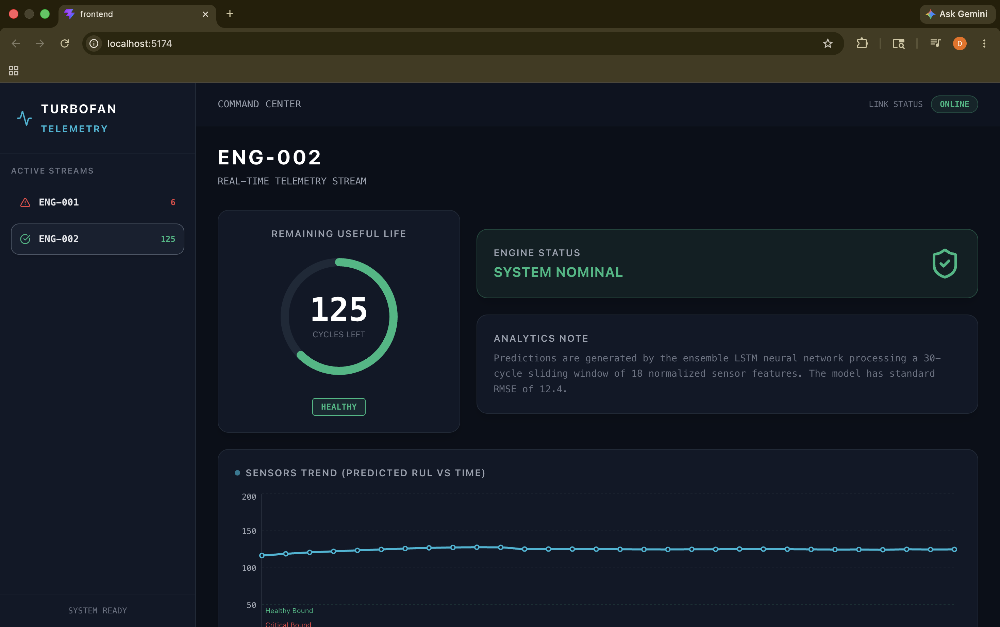
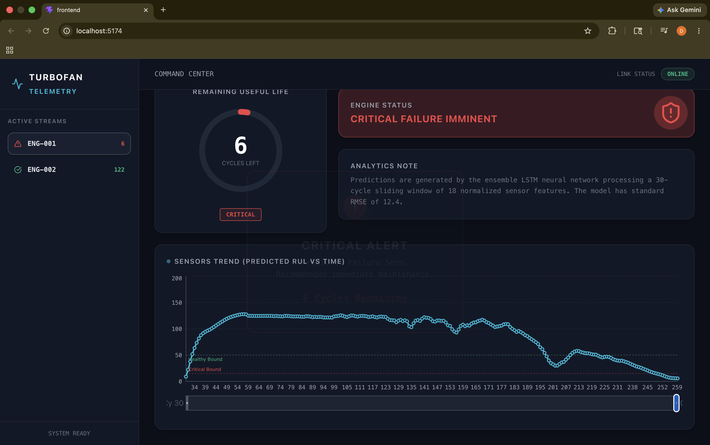
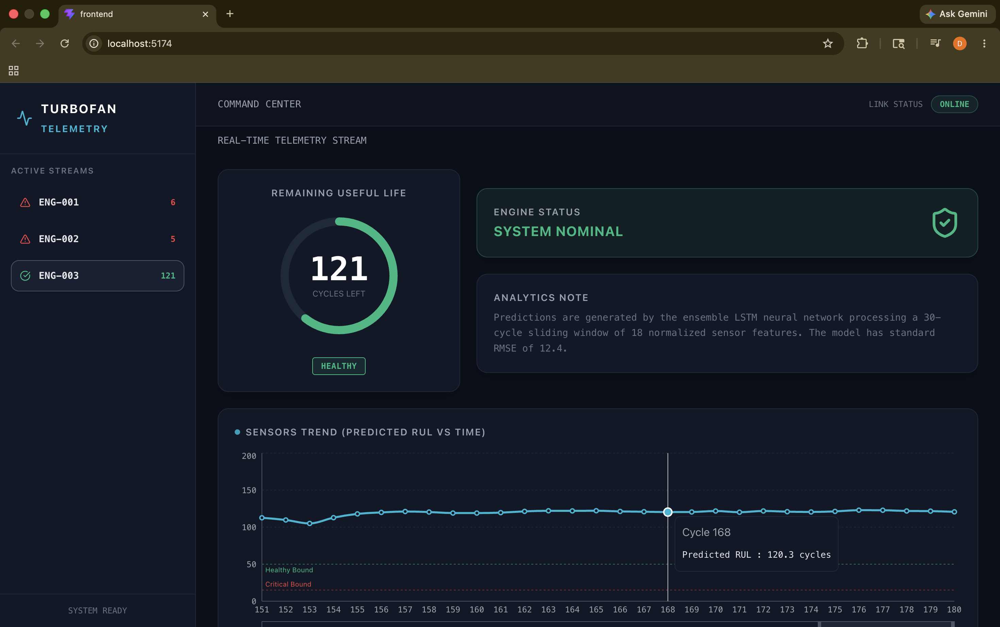
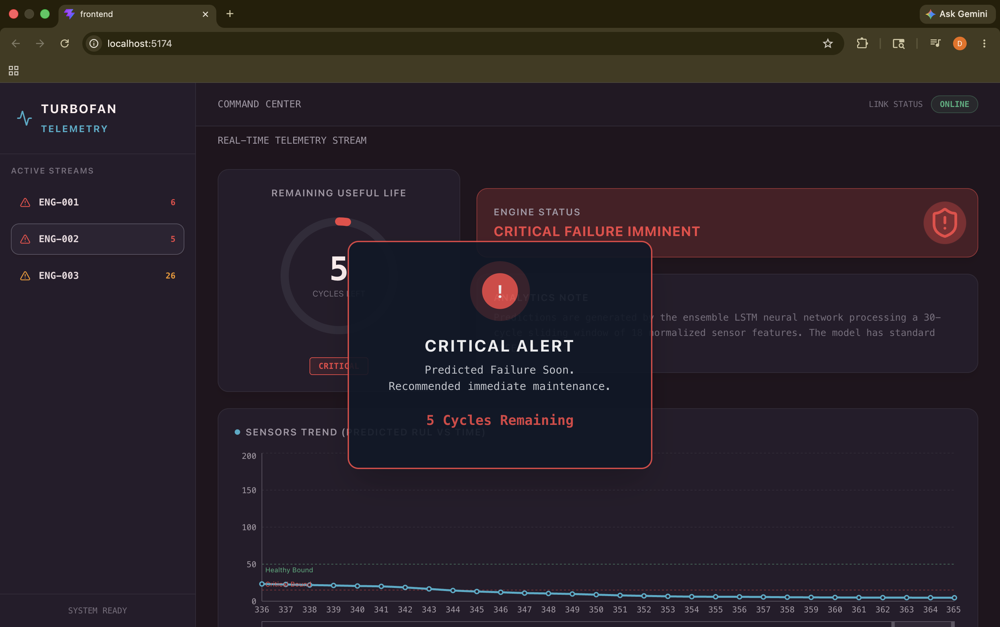

# Predictive Maintenance for Turbofan Engines

An end-to-end Machine Learning web application designed to predict the **Remaining Useful Life (RUL)** of turbofan engines using sensor data. The system features a continuous data streaming pipeline, an interactive dashboard, and an AI model that forecasts equipment failure before it happens.

## Features
- **Real-Time Data Streaming:** Live sensor data (temperature, pressure, vibration, etc.) is streamed via WebSockets.
- **RUL Prediction:** Machine Learning models (XGBoost, TensorFlow/Scikit-learn) forecast the remaining cycles before engine failure.
- **Interactive Dashboard:** A Vite-powered React frontend displaying live telemetry and RUL predictions in real-time.
- **FastAPI Backend:** High-performance async Python backend to handle ML inference and WebSocket broadcasts.
- **Dockerized Architecture:** Easy deployment with a unified `docker-compose` setup for both frontend and backend.

## Technology Stack
- **Backend Analytics:** Python, FastAPI, Pandas, NumPy
- **Machine Learning:** XGBoost, Scikit-learn, TensorFlow
- **Frontend Real-Time UI:** React.js, Vite, WebSockets
- **Infrastructure:** Docker, Docker Compose, Nginx

## Application Screenshots

### Predictive Maintenance Warning


### Healthy Engine Status Dashboard


### Engine Lifetime Prediction Graph


### Live Sensor Readings Visualization


### Critical Failure Alert System


## Demo Video

Watch the complete working demo here:

[Live Project Demo](https://drive.google.com/file/d/1U6BRN47KYP4rQi2Nt4CeHxSt1I93JeWX/view?usp=drive_link)

## Getting Started (Docker)

1. **Clone the repository:**
   ```bash
   git clone https://github.com/yourusername/predictive-maintenance-turbofan.git
   cd predictive-maintenance-turbofan
   ```

2. **Start the application with Docker Compose:**
   ```bash
   docker-compose up --build
   ```

3. **Access the services:**
   - **Frontend Dashboard:** [https://predictive-maintenance-for-turbofan.vercel.app/](https://predictive-maintenance-for-turbofan.vercel.app/)
        > **Note:**  
        > The backend API is deployed and publicly accessible.  
        > Due to WebSocket and cloud deployment limitations on free-tier hosting, the full real-time frontend dashboard is recommended to be run locally after cloning the repository.
   - **Backend API Docs:** [https://turbofan-backend.onrender.com/docs](https://turbofan-backend.onrender.com/docs)
  
4. ## System Architecture

```text
Sensor Stream Simulator
          ↓
     FastAPI Backend
          ↓
   ML Prediction Engine
          ↓
 WebSocket/API Broadcast
          ↓
 React Real-Time Dashboard
```

## Project Structure
- `/app` - FastAPI application, routers, services, ML inferences, and WebSocket managers.
- `/frontend` - React application handling the real-time visualization of sensor data.
- `/models` - Trained ML models and preprocessing pipelines.
- `/data` - Sample CMAPSS turbofan datasets.
- `/notebooks` - Jupyter notebooks containing data exploration and model training logic.

## Future Improvements

- Kubernetes deployment for scalable streaming
- Kafka integration for distributed telemetry ingestion
- Grafana dashboards for advanced monitoring
- AWS/GCP deployment pipelines
- LSTM model optimization for higher prediction accuracy
- Real-time alert notification system

## License
This project is open-source and available under the [MIT License](LICENSE).
